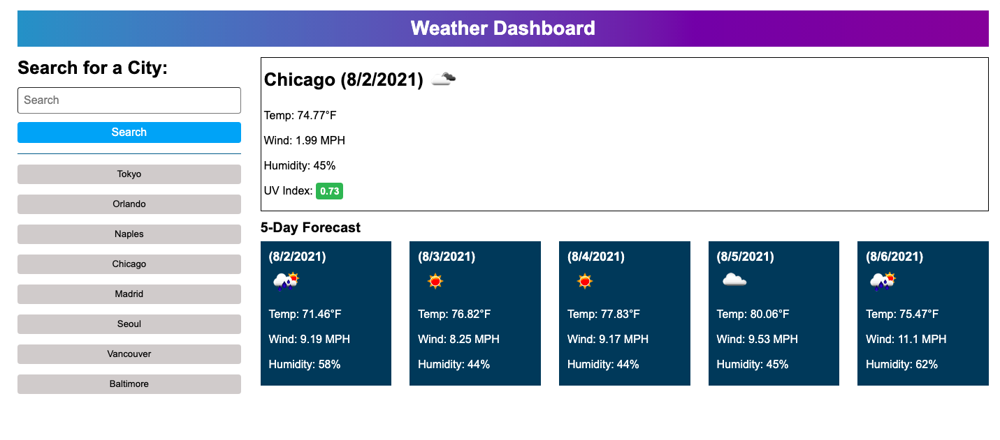

# 5. Server-Side APIs Challenge: Weather Dashboard

## Description

Welcome to my Weather Dashboard! Simply enter the name of a city into the search form, and this application will display both the current weather and a five day forecast for that city. Upon submitting your search, the application retrieves weather information from the Open Weather server-side APIs and dynamically generates the HTML necessary to display the weather to you. Each city you search for is saved as a button in the sidebar on the right, simply click on the name of your saved city and it will be run as a search. These saved cities persist on the same device between sessions.

## Deployment

You can visit the live application [here](https://aidanamato.github.io/weather-dashboard/).

## Credits

Third Party APIs

- [Open Weather Current Weather Data API](https://openweathermap.org/current)
- [Open Weather One Call API](https://openweathermap.org/api/one-call-api)

Free Icons PNG

- [Weather Icon](https://www.freeiconspng.com/img/11063)

## License

[MIT](./LICENSE.txt)